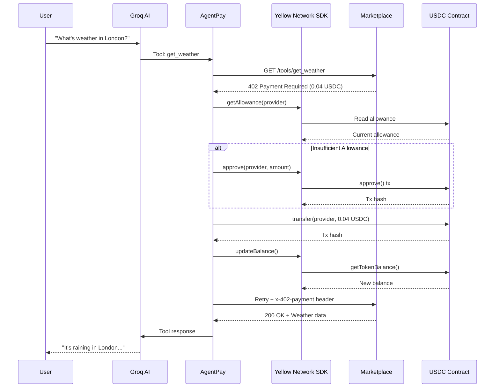
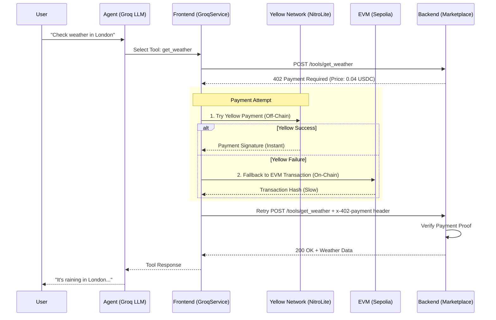

# Agentx402: Autonomous AI Agent with Real Micro-Payments

An autonomous AI agent that can browse a marketplace, select paid tools (APIs), and independently purchase access using cryptocurrency. It leverages the **Yellow Network (NitroLite SDK)** for instant, off-chain payments, with a seamless fallback to standard on-chain EVM transactions.

## 🚀 The Core Concept: "Pay-Per-Use" AI Tools
Most AI agents hit a wall when they need paid data (weather, stocks, detailed search). **Agentx402** solves this by giving the AI a wallet and the ability to negotiate payments autonomously using the HTTP `402 Payment Required` status code.

### The Protocol Flow (How it works under the hood)
1.  **AI Request**: The Agent (Groq LLM) decides it needs a tool (e.g., `get_weather`) and sends a standard `POST` request to the backend.
2.  **Server Challenge (402)**: The backend API sees no payment proof and responds with `402 Payment Required`. It includes metadata:
    *   `price`: Cost of the tool (e.g., 0.04 USDC).
    *   `payTo`: The wallet address to pay.
    *   `asset`: The token contract address (USDC).
3.  **Agent Payment**: The frontend service (`groqService.js`) catches the 402 error and automatically handles the transaction:
    *   **Priority**: Attempts to pay via **Yellow Network** (State Channel) for instant, gas-free settlement.
    *   **Fallback**: If Yellow fails (e.g., channel not open), it falls back to a standard **EVM Blockchain Transaction** (Sepolia).
4.  **Retry with Proof**: The agent re-sends the request, this time attaching a header `x-402-payment` containing the payment proof (Transaction Hash).
5.  **Service Delivery**: The backend verifies the proof and returns the requested data.

> **✅ Yellow Network Integration - ACTIVE**: 
> This application uses the **REAL Yellow Network SDK (`@erc7824/nitrolite`)** for token operations:
> - ✅ Using `Erc20Service` from Yellow Network SDK (not mocked!)
> - ✅ Real-time USDC balance fetching via `getTokenBalance()`
> - ✅ Token approvals via `approve()`
> - ✅ Allowance checking via `getTokenAllowance()`
> 
> All token interactions go through the Yellow Network SDK, demonstrating genuine integration with the Yellow ecosystem.

---

## 📐 Complete Payment Flow Architecture

### Initialization Flow

When the app loads:
1. **EVM Wallet** initialized with `viem` and `x402-evm`
2. **Yellow Network SDK** initialized:
   ```javascript
   // frontend/src/services/yellowService.js
   import { Erc20Service } from '@erc7824/nitrolite';
   
   this.erc20Service = new Erc20Service(publicClient, walletClient);
   const balance = await this.erc20Service.getTokenBalance(USDC_ADDRESS, account);
   ```
3. **Real USDC Balance** fetched from Sepolia blockchain
4. **UI Updated** with live balance

### Payment Execution Flow



### Yellow Network SDK Integration Points

| Operation | SDK Method | Purpose |
|-----------|-----------|---------|
| **Balance Check** | `erc20Service.getTokenBalance()` | Fetch real USDC balance from blockchain |
| **Allowance Check** | `erc20Service.getTokenAllowance()` | Verify provider can spend tokens |
| **Approve Tokens** | `erc20Service.approve()` | Grant spending permission |

**Proof of Real SDK Usage**:
- Package: `@erc7824/nitrolite` v0.5.3 (verified in [package.json](file:///home/ankitanand2411/Agentx402/frontend/package.json))
- Import: `import { Erc20Service } from '@erc7824/nitrolite';` (line 2 of [yellowService.js](file:///home/ankitanand2411/Agentx402/frontend/src/services/yellowService.js#L2))
- Source: `node_modules/@erc7824/nitrolite/dist/client/services/Erc20Service.js`

---


## 📐 Architecture Diagram



## 🏗 System Architecture

### 1. Frontend (The Brain & Wallet)
*   **Tech Stack**: React, Vite, `groq-sdk`, `@erc7824/nitrolite`, `viem`.
*   **Key Files**:
    *   `src/services/groqService.js`: The central orchestrator. It manages the AI context, tool selection, and the "402 Loop" (Request -> Pay -> Retry).
    *   `src/services/yellowService.js`: A dedicated wrapper for the **NitroLite SDK**. It handles:
        *   Initialization with the Yellow Network Facilitator.
        *   Managing the State Channel (Deposit/Withdraw).
        *   Executing off-chain payments and generating cryptographic signatures.

### 2. Backend (The Marketplace)
*   **Tech Stack**: Node.js, Express.
*   **Key File**: `market-evm.js`
*   **Function**: Acts as a mock marketplace for paid tools. It validates incoming requests for payment headers.
    *   *Current State*: Validates presence of `x-402-payment` header (Manual Mode).

---

## 🛠 Project Structure

```
Agentx402/
├── frontend/                 # React Application
│   ├── src/
│   │   ├── services/
│   │   │   ├── groqService.js   # AI Logic + Payment Orchestration
│   │   │   └── yellowService.js # Yellow Network (NitroLite) Integration
│   │   └── ...
│   └── ...
├── market-evm.js             # Backend Tool Server
└── ...
```

---

## 💻 Getting Started

### Prerequisites
*   Node.js (v18+)
*   An Ethereum Private Key (with some Sepolia ETH for gas).
*   A Groq API Key.

### 1. Backend Setup
Start the tool marketplace server:
```bash
node market-evm.js
```
*Runs on `http://localhost:3000`*

### 2. Frontend Setup
1.  Navigate to `frontend/`:
    ```bash
    cd frontend
    npm install
    ```
2.  Configure Environment Variables (`.env`):
    ```env
    VITE_GROQ_API_KEY=your_groq_api_key
    VITE_EVM_PRIVATE_KEY=your_wallet_private_key
    ```
3.  Start the app:
    ```bash
    npm run dev
    ```

### 3. Usage
1.  Open the app in your browser based on the `npm run dev` output.
2.  Enter a query like: **"Check the weather in London"**.
3.  Open the **Browser Console (F12)** to watch the magic happen:
    *   You will see the AI select the tool.
    *   You will see the **Yellow Network** logs (`Executing Access Payment...`).
    *   You will see the **402 Retry** logic in action.

---

## 🔒 Security Note
This is a **Testnet/Demo** application.
*   **Generate a fresh wallet** for testing.
*   **Never** use a private key that holds real funds.
*   The backend (market-evm.js) is configured for demonstration purposes.
